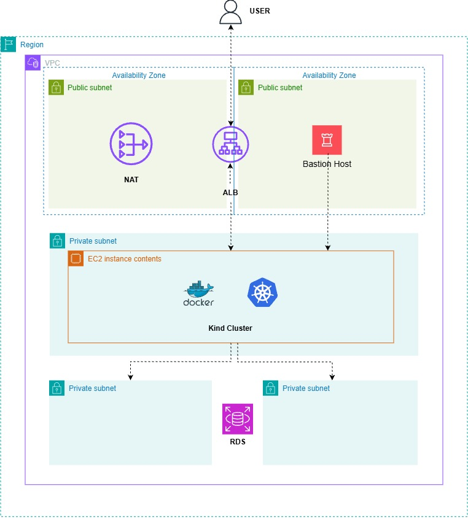
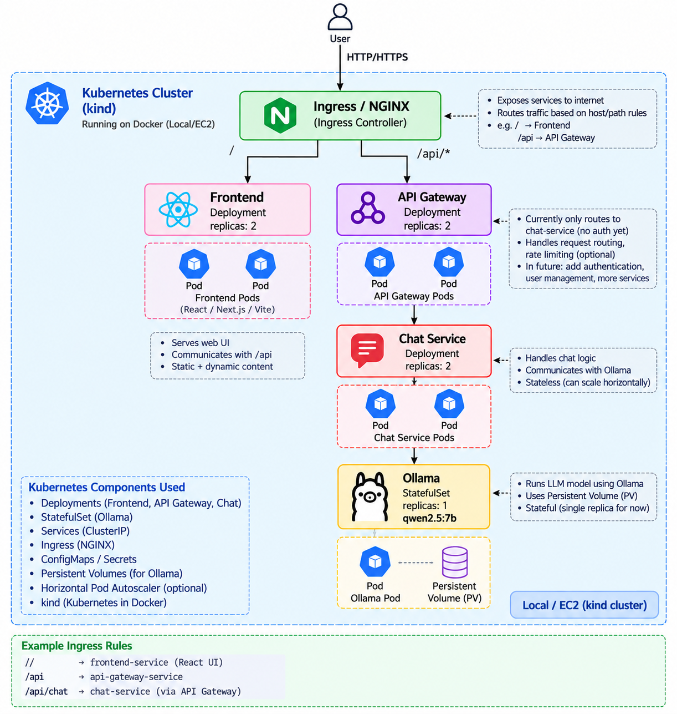

# 🤖 LLM AI Assistant - Kubernetes & AWS Deployment

A containerized LLM-based AI assistant deployed on a Kubernetes cluster
using **kind (Kubernetes in Docker)** and hosted on an **AWS EC2
instance**.

The project demonstrates a practical microservices architecture with an
**NGINX Ingress Controller, API Gateway, Chat Service, Ollama,
Kubernetes Deployments, StatefulSet, Services, ConfigMaps, Secrets, and
persistent storage**.

The infrastructure is designed with AWS networking components including
a **VPC, public/private subnets, Application Load Balancer, NAT Gateway,
Bastion Host, EC2, and Amazon RDS**.

------------------------------------------------------------------------

## 🔍 Project Overview

The LLM AI Assistant is built as a multi-service application where
incoming HTTP/HTTPS traffic is handled by NGINX Ingress and routed to
the appropriate Kubernetes service.

The main application flow is:

``` text
Internet
   │
   │ HTTP / HTTPS
   ▼
NGINX Ingress Controller
   │
   ▼
API Gateway
   │
   ▼
Chat Service
   │
   ▼
Ollama
   │
   ▼
Qwen 2.5:7B LLM
```

The project demonstrates:

-   Containerized LLM application deployment
-   Kubernetes microservice architecture
-   NGINX Ingress routing
-   API Gateway pattern
-   Stateless application services
-   Stateful LLM inference service
-   Ollama model deployment
-   Persistent storage for Ollama
-   Kubernetes Service discovery
-   ConfigMap and Secret management
-   AWS VPC networking
-   EC2-based Kubernetes hosting
-   kind Kubernetes cluster running inside Docker
-   Production-oriented infrastructure concepts

------------------------------------------------------------------------

## 🏗️ Architecture

### AWS Infrastructure

The Kubernetes cluster runs on an EC2 instance inside a private subnet.



### Kubernetes / kind Cluster

The application workloads run inside a kind Kubernetes cluster hosted on
Docker.



------------------------------------------------------------------------

## ☸️ Kubernetes Architecture

The Kubernetes cluster contains the following application components.

### NGINX Ingress

NGINX acts as the external entry point for HTTP/HTTPS traffic.

Responsibilities:

-   Accept incoming HTTP/HTTPS requests
-   Route traffic using Kubernetes Ingress rules
-   Forward `/api/*` traffic to the API Gateway
-   Provide a single application entry point

Example routing:

``` text
/        → frontend-service
/api     → api-gateway-service
/api/chat → chat-service (through API Gateway)
```

------------------------------------------------------------------------

### API Gateway

The API Gateway is deployed as a Kubernetes Deployment with two
replicas.

``` text
API Gateway
Deployment
replicas: 2
```

Responsibilities:

-   Receive API requests
-   Handle request routing
-   Forward requests to backend services
-   Provide a central location for future authentication and
    authorization
-   Provide a foundation for rate limiting and additional services

Current architecture routes chat requests to the Chat Service.

------------------------------------------------------------------------

### Chat Service

The Chat Service is a stateless Kubernetes Deployment.

``` text
Chat Service
Deployment
replicas: 2
```

Responsibilities:

-   Handle chat request logic
-   Communicate with Ollama
-   Process LLM requests
-   Return generated responses
-   Scale horizontally using multiple replicas

Because the Chat Service is stateless, multiple replicas can process
requests independently.

------------------------------------------------------------------------

### Ollama

Ollama runs the LLM inference workload.

``` text
Ollama
StatefulSet
replicas: 1
model: qwen2.5:7b
```

Ollama is deployed as a StatefulSet because the model data requires
persistent storage.

Responsibilities:

-   Run the local LLM
-   Serve the Qwen 2.5 7B model
-   Provide an internal inference endpoint
-   Persist downloaded model data
-   Handle inference requests from the Chat Service

The current architecture uses one Ollama replica because LLM inference
is resource-intensive.

------------------------------------------------------------------------

## 💾 Persistent Storage

Ollama uses Kubernetes persistent storage for model data.

``` text
              Ollama StatefulSet
                       │
                       ▼
                  Ollama Pod
                       │
                       ▼
             Persistent Volume
                       │
                       ▼
             Persistent Model Data
```

Persistent storage prevents downloaded LLM model data from being lost
when the Ollama pod is recreated.

This also demonstrates the difference between:

``` text
Stateless Workloads
────────────────────
API Gateway
Chat Service

Stateful Workload
─────────────────
Ollama
```

------------------------------------------------------------------------

## 🔄 Request Flow

A typical user request follows this path:

``` text
User
 │
 │ HTTP / HTTPS
 ▼
AWS ALB
 │
 ▼
NGINX Ingress
 │
 │ /api/*
 ▼
API Gateway
 │
 ▼
Chat Service
 │
 ▼
Ollama
 │
 ▼
Qwen 2.5:7B
 │
 │ Generated response
 ▼
Chat Service
 │
 ▼
API Gateway
 │
 ▼
NGINX Ingress
 │
 ▼
User
```

------------------------------------------------------------------------

## 🔐 Configuration & Security

The application uses Kubernetes configuration resources to separate
configuration from application containers.

### ConfigMaps

ConfigMaps are used for non-sensitive configuration such as:

-   Application configuration
-   Service endpoints
-   Environment-specific settings
-   Kubernetes service names

### Secrets

Kubernetes Secrets are used for sensitive configuration such as:

-   Database credentials
-   Application secrets
-   Protected environment variables

> Real production credentials should never be committed directly to a
> Git repository. Production deployments should use a dedicated
> secret-management solution.

------------------------------------------------------------------------

## 🌐 Kubernetes Networking

Kubernetes Services provide internal service discovery.

The communication flow is:

``` text
NGINX Ingress
      │
      ▼
API Gateway Service
      │
      ▼
Chat Service
      │
      ▼
Ollama Service
```

Services allow application components to communicate using stable
Kubernetes DNS names instead of directly addressing pod IPs.

------------------------------------------------------------------------

------------------------------------------------------------------------

## 🔄 CI/CD Pipeline

The project includes **Jenkinsfiles** for automating the application
build, containerization, image publishing, and Kubernetes deployment
workflow.

The CI/CD flow is:

``` text
Developer
    │
    ▼
  GitHub
    │
    │ Webhook / Build Trigger
    ▼
 Jenkins
    │
    ├── Checkout Source
    │
    ├── Build & Test
    │
    ├── Docker Build
    │
    ├── Docker Image Tag
    │
    ├── Push Image to Container Registry
    │
    └── Deploy / Rollout to Kubernetes
             │
             ▼
       kind Kubernetes Cluster
             │
             ├── API Gateway
             ├── Chat Service
             └── Ollama
```

### Jenkins Responsibilities

Jenkins automates the application delivery process:

-   Checkout source code from GitHub
-   Build application components
-   Run application checks/tests where configured
-   Build Docker images
-   Tag container images
-   Push images to the configured container registry
-   Deploy updated workloads to Kubernetes
-   Monitor Kubernetes rollout status

### Jenkinsfiles

Pipeline definitions are maintained as code using Jenkinsfiles.

Example repository structure:

``` text
.
├── Jenkinsfile
├── Jenkinsfile.api-gateway
├── Jenkinsfile.chat-service
├── Jenkinsfile.frontend
└── ...
```

> Update the Jenkinsfile names above to match the exact files in the
> repository.

Using Jenkinsfiles keeps CI/CD pipeline configuration version-controlled
alongside the application source code.

### Deployment Flow

``` text
Git Push
   │
   ▼
Jenkins Pipeline
   │
   ├── Checkout
   ├── Build
   ├── Test
   ├── Docker Build
   └── Docker Push
            │
            ▼
     Container Registry
            │
            ▼
      Kubernetes Update
            │
            ▼
    Rolling Deployment
            │
            ▼
      Updated Pods
```

This provides an automated path from source-code changes to a Kubernetes
deployment.

## 🚀 Kubernetes Deployment

### Create Namespace

``` bash
kubectl apply -f k8s/namespace.yml
```

### Deploy Ollama

``` bash
kubectl apply -f k8s/ollama/
```

### Deploy Chat Service

``` bash
kubectl apply -f k8s/chat/
```

### Deploy API Gateway

``` bash
kubectl apply -f k8s/api-gateway/
```

### Deploy Frontend

``` bash
kubectl apply -f k8s/frontend/
```

### Deploy Ingress

``` bash
kubectl apply -f k8s/ingress.yml
```

------------------------------------------------------------------------

## 🔎 Verify Deployment

Check all Kubernetes resources:

``` bash
kubectl get all -n <namespace>
```

Check pods:

``` bash
kubectl get pods -n <namespace>
```

Check services:

``` bash
kubectl get svc -n <namespace>
```

Check deployments:

``` bash
kubectl get deployments -n <namespace>
```

Check StatefulSets:

``` bash
kubectl get statefulsets -n <namespace>
```

Check persistent volumes:

``` bash
kubectl get pv
```

Check persistent volume claims:

``` bash
kubectl get pvc -n <namespace>
```

Check Ingress:

``` bash
kubectl get ingress -n <namespace>
```

------------------------------------------------------------------------

## 🛠️ Troubleshooting

View pod logs:

``` bash
kubectl logs <pod-name> -n <namespace>
```

Follow logs:

``` bash
kubectl logs -f <pod-name> -n <namespace>
```

Describe a pod:

``` bash
kubectl describe pod <pod-name> -n <namespace>
```

Check Deployment rollout:

``` bash
kubectl rollout status deployment/<deployment-name> -n <namespace>
```

Restart a Deployment:

``` bash
kubectl rollout restart deployment/<deployment-name> -n <namespace>
```

Check Kubernetes events:

``` bash
kubectl get events -n <namespace>
```

Check Ollama logs:

``` bash
kubectl logs <ollama-pod> -n <namespace>
```

Check model availability:

``` bash
kubectl exec -it <ollama-pod> -n <namespace> -- ollama list
```

------------------------------------------------------------------------

## 🐳 Docker & kind

The Kubernetes cluster is created using **kind**, which runs Kubernetes
nodes as Docker containers.

Architecture:

``` text
AWS EC2
   │
   ▼
Docker
   │
   ▼
kind Kubernetes Cluster
   │
   ├── NGINX Ingress
   ├── API Gateway
   ├── Chat Service
   └── Ollama
```

This approach provides a lightweight Kubernetes environment while still
allowing the project to use real Kubernetes workloads and networking
concepts.

------------------------------------------------------------------------

## ☁️ AWS Infrastructure

The Kubernetes environment is hosted on AWS infrastructure.

### AWS Components

-   Amazon VPC
-   Public Subnets
-   Private Subnets
-   Availability Zones
-   Application Load Balancer
-   NAT Gateway
-   Bastion Host
-   Amazon EC2
-   Amazon RDS
-   Security Groups
-   kind Kubernetes Cluster
-   Docker

### Network Design

``` text
                         Internet
                            │
                            ▼
                           ALB
                            │
                 ┌──────────┴──────────┐
                 │                     │
          Public Subnet          Public Subnet
                 │                     │
          NAT Gateway             Bastion Host
                 │                     │
                 └──────────┬──────────┘
                            │
                            ▼
                    Private Subnet
                            │
                       EC2 Instance
                            │
                         Docker
                            │
                      kind Cluster
                            │
                  ┌─────────┴─────────┐
                  │                   │
              Kubernetes           RDS
               Workloads
```

The EC2 instance hosting the kind cluster is placed in a private subnet,
while public-facing networking components are placed in public subnets.

------------------------------------------------------------------------

## 📦 Project Structure

``` text
.
├── backend/
│   ├── Dockerfile
│   ├── package.json
│   └── src/
│
├── frontend/
│   ├── Dockerfile
│   ├── package.json
│   └── src/
│
├── api-gateway/
│   ├── Dockerfile
│   ├── package.json
│   └── src/
│
├── chat-service/
│   ├── Dockerfile
│   ├── package.json
│   └── src/
│
├── k8s/
│   ├── namespace.yml
│   ├── ingress.yml
│   │
│   ├── frontend/
│   │   ├── deployment.yml
│   │   └── service.yml
│   │
│   ├── api-gateway/
│   │   ├── configmap.yml
│   │   ├── deployment.yml
│   │   ├── secret.yml
│   │   └── service.yml
│   │
│   ├── chat/
│   │   ├── configmap.yml
│   │   ├── deployment.yml
│   │   ├── secret.yml
│   │   └── service.yml
│   │
│   └── ollama/
│       ├── pvc.yml
│       ├── deployment.yml
│       ├── service.yml
│       └── statefulset.yml
│
├── Jenkinsfile
├── Jenkinsfile.api-gateway
├── Jenkinsfile.chat-service
├── Jenkinsfile.frontend
│
├── terraform/
│   ├── vpc/
│   ├── ec2/
│   ├── alb/
│   └── rds/
│
└── README.md
```

> Update the directory names above if your repository uses different
> paths.

------------------------------------------------------------------------

## 🧩 Kubernetes Components Used

-   Kubernetes Namespace
-   Deployments
-   Pods
-   Services
-   Ingress
-   NGINX Ingress Controller
-   StatefulSet
-   PersistentVolume
-   PersistentVolumeClaim
-   ConfigMaps
-   Secrets
-   Kubernetes Service Discovery
-   kind
-   Docker

------------------------------------------------------------------------

## ☁️ AWS Components Used

-   VPC
-   Availability Zones
-   Public Subnets
-   Private Subnets
-   Application Load Balancer
-   NAT Gateway
-   Bastion Host
-   EC2
-   Amazon RDS
-   Security Groups

------------------------------------------------------------------------

## 🛠️ Technology Stack

### Application

-   LLM / Generative AI
-   Ollama
-   Qwen 2.5 7B
-   API Gateway
-   Chat Service
-   Frontend

### DevOps

-   Docker
-   Kubernetes
-   kind
-   kubectl
-   NGINX Ingress

### Cloud

-   AWS
-   Amazon EC2
-   Amazon VPC
-   Application Load Balancer
-   NAT Gateway
-   Amazon RDS

### Infrastructure as Code

-   Terraform

### Source Control

-   Git
-   GitHub

### Configuration

-   YAML
-   Environment Variables
-   Kubernetes ConfigMaps
-   Kubernetes Secrets

### Operating System

-   Linux

------------------------------------------------------------------------

## 📚 Learning Outcomes

This project demonstrates practical understanding of:

-   Docker containerization
-   Kubernetes architecture
-   Kubernetes Deployments
-   Kubernetes Services
-   Kubernetes Ingress
-   NGINX Ingress Controller
-   StatefulSets
-   Persistent storage
-   ConfigMaps
-   Kubernetes Secrets
-   Service discovery
-   Microservice communication
-   API Gateway architecture
-   LLM inference deployment
-   Ollama
-   Kubernetes troubleshooting
-   kind Kubernetes clusters
-   AWS VPC networking
-   Public and private subnet architecture
-   EC2-based Kubernetes hosting
-   Infrastructure as Code with Terraform

------------------------------------------------------------------------

## 🎯 Project Highlights

-   Containerized LLM AI assistant
-   Microservice-based Kubernetes architecture
-   NGINX Ingress for HTTP/HTTPS routing
-   API Gateway with two replicas
-   Chat Service with two replicas
-   Ollama StatefulSet
-   Qwen 2.5 7B model
-   Persistent storage for LLM model data
-   Kubernetes service discovery
-   AWS private-subnet deployment
-   EC2-hosted kind Kubernetes cluster
-   Application Load Balancer
-   NAT Gateway
-   Bastion Host
-   Amazon RDS integration
-   Terraform-based AWS infrastructure
-   Kubernetes troubleshooting and operational workflows

------------------------------------------------------------------------

## 🔮 Future Improvements

The project can be extended with additional production-oriented
capabilities:

-   Helm Charts
-   Horizontal Pod Autoscaler (HPA)
-   CPU and memory requests/limits
-   Liveness and readiness probes
-   TLS/HTTPS with cert-manager
-   Prometheus and Grafana monitoring
-   Centralized logging
-   Container image scanning
-   External Secrets Management
-   Kubernetes RBAC
-   Network Policies
-   GitOps with ArgoCD
-   Automated CI/CD pipeline
-   Amazon EKS migration
-   GPU-enabled LLM inference
-   Multiple Ollama replicas with an appropriate inference architecture
-   Model serving optimization

------------------------------------------------------------------------

## 📸 Architecture Diagrams

Recommended repository structure for architecture documentation:

``` text
docs/
└── images/
    ├── aws-infrastructure.png
    └── kubernetes-architecture.png
```

Add the diagrams to the README using:

``` markdown


```

------------------------------------------------------------------------

## 👤 Dev

**Vaibhav Umbarkar**

DevOps \| AWS \| Kubernetes \| Docker \| Terraform \| Jenkins
\| CI/CD
