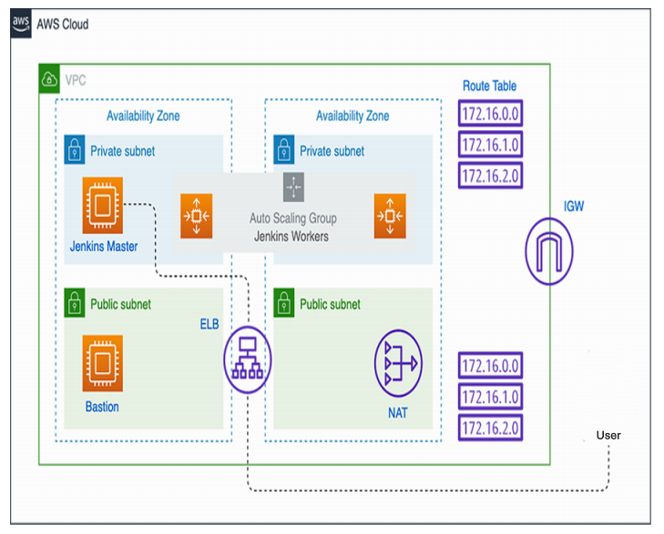

# Jenkins Highly Available Cluster on AWS using Terraform

A production-style Jenkins infrastructure deployed on **AWS** using **Terraform (Infrastructure as Code)**.

This project demonstrates how to build a secure, scalable, and highly available Jenkins environment where:

- Jenkins Controller (Master) runs in a private subnet.
- Build Agents are launched dynamically using the **Jenkins Amazon EC2 Plugin**.
- Infrastructure spans multiple Availability Zones for resilience.
- Administrative access is provided through a Bastion Host.
- Outbound internet access for private resources is enabled through a NAT Gateway.

---

## 🔍 Project Overview

This infrastructure is designed for:

- CI/CD platform deployment on AWS
- Secure Jenkins controller hosting
- Dynamic build agent provisioning
- Infrastructure automation with Terraform
- Learning real-world DevOps architecture patterns

---

## 🏗️ Architecture



### Architecture Components

#### VPC Layer
- Custom VPC
- Public and Private Subnets
- Route Tables
- Internet Gateway (IGW)
- NAT Gateway

#### Public Tier
- Bastion Host for secure administration
- Elastic Load Balancer (ELB)
- NAT Gateway

#### Private Tier
- Jenkins Controller (Master)
- Auto Scaling Group for Jenkins Worker Nodes
- Dynamic EC2 Agent Provisioning via Jenkins EC2 Plugin

---

## ⚙️ Infrastructure Design

### Jenkins Controller

The Jenkins Controller is deployed inside a **private subnet** to minimize exposure to the public internet.

Responsibilities:

- Manage pipelines and jobs
- Schedule builds
- Launch and terminate EC2 agents dynamically
- Maintain build history and configurations

### Jenkins Agents

Build agents are provisioned automatically using the **Amazon EC2 Plugin**.

Features:

- On-demand agent creation
- Automatic agent termination after build completion
- Cost optimization
- Horizontal scalability for parallel builds

### Bastion Host

The Bastion Host provides controlled SSH access to private resources.

Benefits:

- Secure administration
- Reduced attack surface
- Centralized access point

---

## 🔄 Build Execution Flow

1. Developer triggers a Jenkins job.
2. Request reaches Jenkins through the Load Balancer.
3. Jenkins Controller evaluates build requirements.
4. Amazon EC2 Plugin launches a new EC2 build agent.
5. Agent connects back to Jenkins Controller.
6. Build executes on the agent.
7. Build results are reported to Jenkins.
8. Idle agents are automatically terminated.

---

## 🛡️ Security Features

- Jenkins Controller hosted in private subnet
- Security Group based access control
- Bastion-based administrative access
- Private-to-public traffic via NAT Gateway only
- Network isolation between infrastructure components
- No direct public access to Jenkins backend instances

---

## ☁️ AWS Services Used

- Amazon VPC
- Amazon EC2
- Auto Scaling Group (ASG)
- Elastic Load Balancer (ELB)
- NAT Gateway
- Internet Gateway
- Route Tables
- Security Groups
- IAM Roles and Policies

---

## 🛠️ Technology Stack

- Terraform
- AWS
- Jenkins
- Amazon EC2 Plugin
- Linux
- Bash

---

## 🚀 Deployment

```bash
terraform init
terraform validate
terraform plan
terraform apply
```

---

## 📚 Learning Outcomes

This project demonstrates:

- Jenkins infrastructure design on AWS
- Dynamic agent provisioning
- Infrastructure as Code (IaC)
- Multi-AZ architecture concepts
- AWS networking fundamentals
- CI/CD platform scalability
- Security best practices for Jenkins

---

## 👤 Dev

**Vaibhav Umbarkar**

DevOps Engineer | AWS | Terraform | Jenkins
